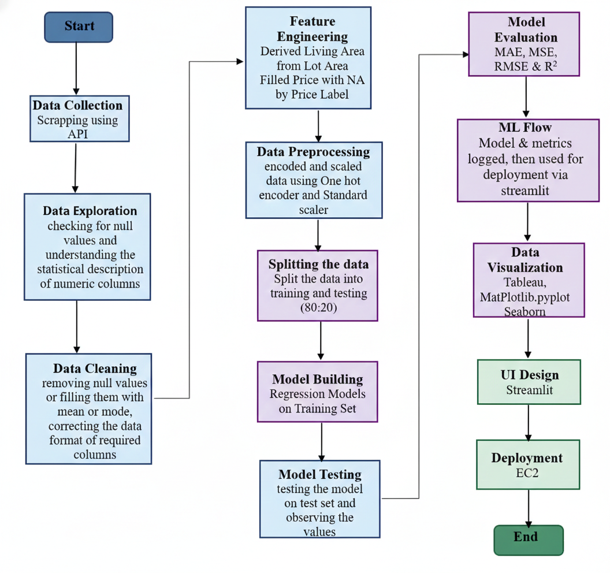
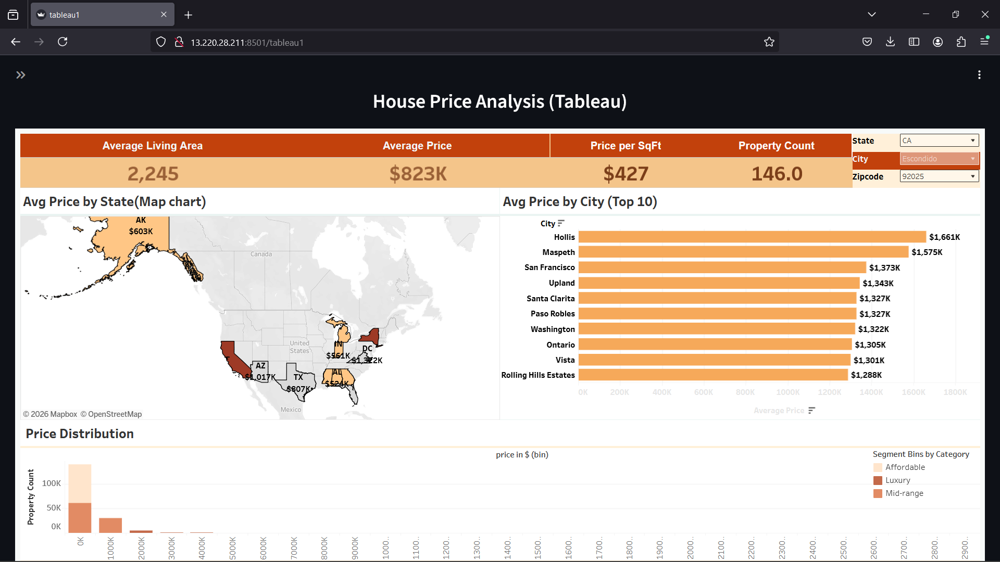
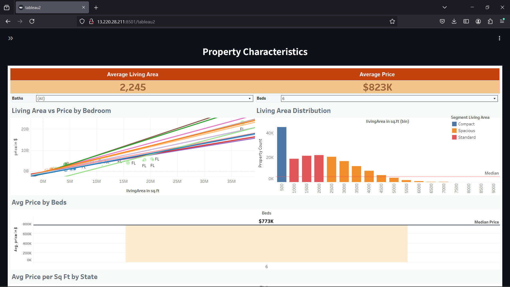
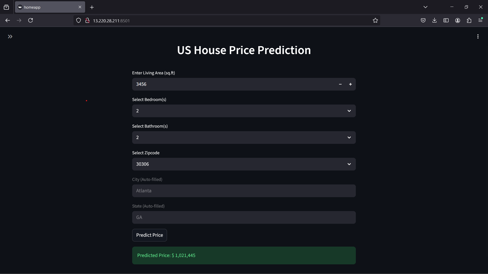

# 🏡 DBDA Housing Price Prediction Pipeline



## 📌 Fast Facts
- **Goal**: End-to-end ML pipeline for predicting residential real estate prices.
- **Top Standard Model**: Random Forest (**~99% R²** on 1-2 Lakh records).
- **Big Data Scale**: Gradient Boosting via PySpark (**~89% R²** on 1 Million records).
- **Key Predictors**: Living Area, Bedrooms, and Bathrooms.

## 🛠️ Tech Stack
- **Data Pipeline**: Zillow APIs (Scrapeak) ➔ Pandas/NumPy ➔ PySpark
- **ML Models**: Scikit-Learn, XGBoost, CatBoost, LightGBM, PySpark MLlib
- **Tracking & Viz**: MLflow, Tableau, Matplotlib
- **Deployment**: Streamlit, Amazon EC2

## 🚀 Pipeline Flow
1. **Acquisition**: Automated data ingestion using Zillow APIs and synthetic generation.
2. **Preprocessing**: Mean/mode imputation for nulls, engineered new features, and scaled numerical columns.
3. **Modeling**: Benchmarked 8+ regression algorithms. Tracked experiments, parameters, and metrics systematically using **MLflow**.
4. **Big Data**: Distributed processing and training on massive datasets utilizing **PySpark**.

## 📊 Market Dashboards & Insights

### 1) Market Analysis
*Focus: Feature-to-Price Relationships | KPIs: Avg Living Area & Avg Price*



### 2) Property Characteristics
*Focus: Geospatial Analysis & Distributions | KPIs: Price per SqFt & Property Count*



## 🌐 Web App Deployment
A user-friendly, interactive frontend was built using **Streamlit** and deployed on **Amazon EC2** for real-time price estimation.



## 📂 Project Structure
```text
📦 DBDA_Housing_Project
├── 📂 Data Acquisition
│   ├── 📄 WebScrapping_zillow.ipynb             
│   └── 📄 synthetic_datagenerator.ipynb         
├── 📂 Data Preprocessing & EDA
│   ├── 📄 Data_Cleaning.ipynb                   
│   ├── 📄 clean_houseprice_data_1.csv           # 1-2 Lakh records
│   └── 📄 Unclean_combined_dataset.csv          
├── 📂 Visualization
│   ├── 📄 Data_Visualization.ipynb              
│   └── 📄 House_Price_Prediction_analysis.twbx  # Tableau Dashboard
├── 📂 Modeling
│   ├── 📄 Model_Training.ipynb                  # Random Forest, XGBoost, etc.
│   ├── 📄 ModelTrainingUsingPyspark.ipynb       # PySpark distributed training
│   ├── 📄 House_price_Model_Train_Log_MLFlow.ipynb 
│   └── 📄 pyspark_dataset.csv                   # ~10 Lakh records
├── 📂 Deployment
│   ├── 📄 House_Price_Model_Load_&_Deploy.ipynb 
│   ├── 📂 HousePricePrediction/                 # Streamlit app code
│   └── 📂 Deployment/                           # Dashboard screenshots
└── 📄 Project_Report_House_Price.docx           
```

---
*This repository contains the code and resources for the PG-Diploma in Big Data Analytics project at C-DAC.*
