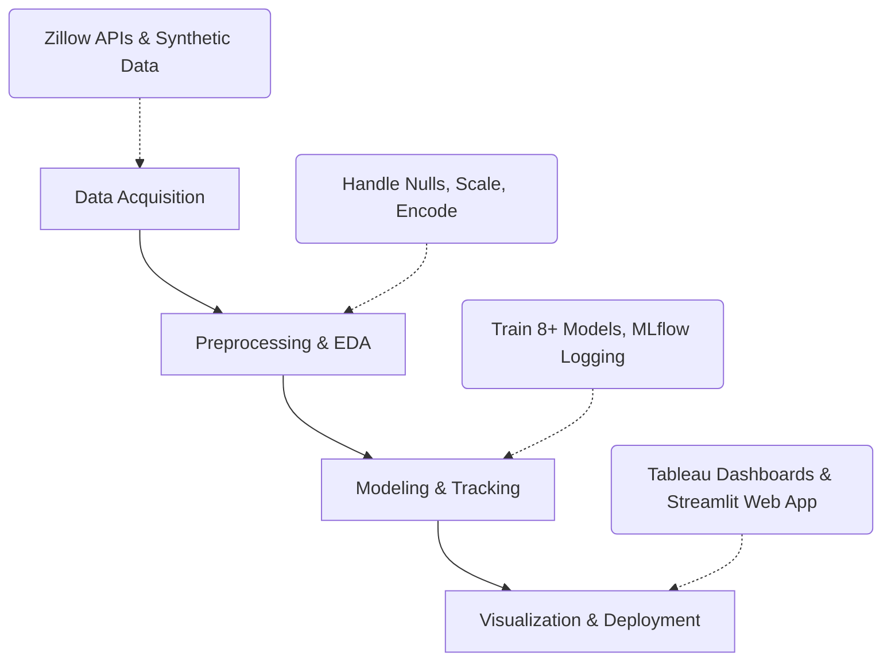

# 🏡 DBDA Housing Price Prediction


## 📌 Fast Facts
- **Goal**: Predict residential real estate prices.
- **Top Model**: Random Forest (**~99% R²** on 2 Lakh records).
- **Big Data Scale**: Gradient Boosting via PySpark (**~89% R²** on 1 Million records).
- **Key Predictors**: Living Area, Bedrooms, and Bathrooms.

## 🛠️ Tech Stack

| Category | Tools / Technologies |
|---|---|
| **Data Pipeline** | Zillow APIs (Scrapeak), Pandas, NumPy, PySpark |
| **Machine Learning** | Scikit-Learn, XGBoost, CatBoost, LightGBM, PySpark MLlib |
| **Tracking & Viz** | MLflow, Tableau, Matplotlib |
| **Deployment** | Streamlit, Amazon EC2 |

## 🚀 Methodology Flow



## 📊 Market Dashboards

### 1) Market Analysis
*KPIs: Avg Living Area, Avg Price, Price per SqFt & Property Count*


### 2) Property Characteristics
*KPIs:Avg Living Area & Avg Price*


## 🌐 Web App Deployment
*Interactive Streamlit app hosted on Amazon EC2.*


## 📂 Project Structure
```text
📦 DBDA_Housing_Project
├── 📂 Data Acquisition
│   ├── 📄 WebScrapping_zillow.ipynb             
│   └── 📄 synthetic_datagenerator.ipynb         
├── 📂 Data Preprocessing & EDA
│   ├── 📄 Data_Cleaning.ipynb                   
│   ├── 📄 clean_houseprice_data_1.csv           
│   └── 📄 Unclean_combined_dataset.csv          
├── 📂 Visualization
│   ├── 📄 Data_Visualization.ipynb              
│   └── 📄 House_Price_Prediction_analysis.twbx  
├── 📂 Modeling
│   ├── 📄 Model_Training.ipynb                  
│   ├── 📄 ModelTrainingUsingPyspark.ipynb       
│   ├── 📄 House_price_Model_Train_Log_MLFlow.ipynb 
│   └── 📄 pyspark_dataset.csv                   
├── 📂 Deployment
│   ├── 📄 House_Price_Model_Load_&_Deploy.ipynb 
│   ├── 📂 HousePricePrediction/                 
│   └── 📂 Deployment/                           
└── 📄 Project_Report_House_Price.docx           
```
## 💡 Key Insights
- **Model Efficacy**: Random Forest achieved an outstanding **~99% R²** on the standard 1-2 lakh dataset, making it the most reliable model for medium-sized data.
- **Big Data Scalability**: The pipeline proved highly scalable, with Gradient Boosting via PySpark maintaining an **~89% R² score** even when the dataset size was increased 10x to 1 million records.
- **Feature Importance**: Living Area is the most significant predictor of price, with clear positive correlations highlighted in the Tableau dashboards.
- **Geospatial Trends**: Geospatial mapping reveals high concentrations of premium properties in specific coastal and metropolitan regions, with significant variances in Price per SqFt across different states.

## 🏁 Conclusion
This project successfully demonstrated a complete end-to-end Machine Learning lifecycle for real estate valuation. By automating data ingestion via web scraping, rigorously testing various regression algorithms, and successfully scaling the solution with PySpark for Big Data processing, the pipeline provides robust, real-time pricing estimates. Furthermore, the integration of Tableau dashboards and a Streamlit web app ensures that both technical and non-technical stakeholders (investors, homebuyers) can interactively explore the data and derive actionable insights.
