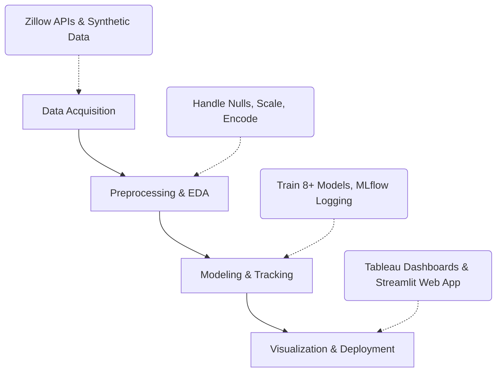

# 🏡 DBDA Housing Price Prediction


## 📌 Fast Facts
- **Goal**: Predict residential real estate prices.
- **Top Model**: Random Forest (**~99% R²** on 2 Lakh records).
- **Big Data Scale**: Gradient Boosting via PySpark (**~89% R²** on 1 Million records).
- **Key Predictors**: Living Area, Bedrooms, and Bathrooms.

## 🛠️ Tech Stack

| Category | Tools / Technologies |
|---|---|
| **Data Pipeline** | Zillow APIs (Scrapeak), Pandas, NumPy, PySpark |
| **Machine Learning** | Scikit-Learn, XGBoost, CatBoost, LightGBM, PySpark MLlib |
| **Tracking & Viz** | MLflow, Tableau, Matplotlib |
| **Deployment** | Streamlit, Amazon EC2 |

## 🚀 Methodology Flow



## 📊 Market Dashboards

### 1) Market Analysis
*KPIs: Avg Living Area & Avg Price*


### 2) Property Characteristics
*KPIs: Price per SqFt & Property Count*


## 🌐 Web App Deployment
*Interactive Streamlit app hosted on Amazon EC2.*


## 📂 Project Structure
```text
📦 DBDA_Housing_Project
├── 📂 Data Acquisition
│   ├── 📄 WebScrapping_zillow.ipynb             
│   └── 📄 synthetic_datagenerator.ipynb         
├── 📂 Data Preprocessing & EDA
│   ├── 📄 Data_Cleaning.ipynb                   
│   ├── 📄 clean_houseprice_data_1.csv           
│   └── 📄 Unclean_combined_dataset.csv          
├── 📂 Visualization
│   ├── 📄 Data_Visualization.ipynb              
│   └── 📄 House_Price_Prediction_analysis.twbx  
├── 📂 Modeling
│   ├── 📄 Model_Training.ipynb                  
│   ├── 📄 ModelTrainingUsingPyspark.ipynb       
│   ├── 📄 House_price_Model_Train_Log_MLFlow.ipynb 
│   └── 📄 pyspark_dataset.csv                   
├── 📂 Deployment
│   ├── 📄 House_Price_Model_Load_&_Deploy.ipynb 
│   ├── 📂 HousePricePrediction/                 
│   └── 📂 Deployment/                           
└── 📄 Project_Report_House_Price.docx           
```
